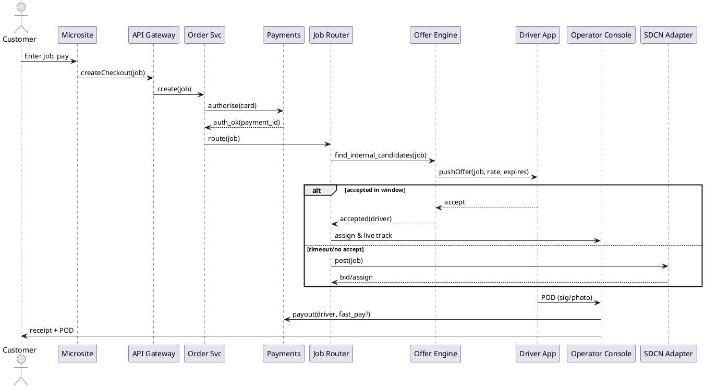
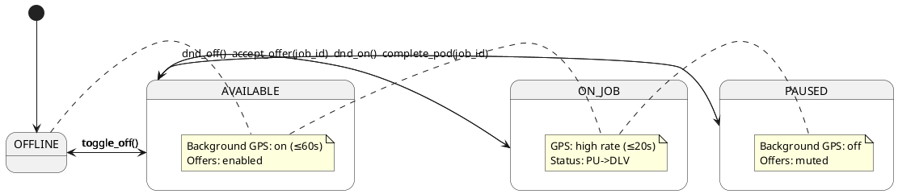

# SPEC-1 — ParcelEvo SaaS MVP

## Background

**Context**  
The UK same‑day courier market relies on digital exchanges for capacity matching. Courier Exchange (CX) is the dominant network; Same Day Courier Network (SDCN) is a lower‑cost, app‑first competitor. Both are useful yet imperfect. Drivers and transport offices consistently report pain around: bidding economics, slow/uncertain payments, unreliable notifications/tracking, inconsistent data quality, and weak trust/compliance signals.

**Our wedge**  
Build a **payments‑aware, trust‑forward, mobile‑excellent** platform that is demand‑led (local city microsites with instant checkout), fulfils via our **own driver bench first** and **exchanges as overflow**, and gradually evolves into a closed invite‑only exchange. Early execution emphasises **North‑first mesh districts** (Chester, Wrexham, Warrington, Manchester, Stoke, Derby, Nottingham), with **London later** (CC/ULEZ/LTN‑aware pricing).

**Founder constraints**  
- 4‑on / 4‑off Army rota; solo founder initially.  
- No ad budget; organic + outbound only.  
- Founder may occasionally drive **only** for high‑margin runs / proving lanes / SLA protection (max **two half‑days/week**, approved).

**Brand strategy**  
Introduce a **Brand Partner** driver program: +**7% uplift** for approved livery and reliability (pass‑through to customer by default) and **7‑day fast‑pay**. Drivers remain independent (offer/accept; multi‑home).

---

## Requirements (MoSCoW)

**Must have (MVP)**
- **Local demand intake**: city microsites with instant card/SCA checkout → creates **Job** in core platform.
- **Dispatch connectors**: manual post to SDCN (first) and CX (as needed); store external job IDs and statuses.
- **Driver app (network mode)**: login, **Availability toggle**, background GPS **only when Available/On‑Job**, one‑tap accept/decline.
- **Proactive offers**: live **nearby job offers** (auto‑calc distance‑to‑pickup, ETA, and rate).  
- **Operator console**: live map & queue, click‑to‑offer/call, exception views.
- **POD workflow**: pickup/delivery statuses, signature/photos, geo/timestamps, single shareable POD PDF.
- **Payments**: customer pay‑in at booking; supplier payout on POD/Invoice with optional **7‑day fast‑pay**. Basic ledger & reconciliation.
- **Compliance vault**: capture GIT, H&R, PL, licence, RTW (+DBS for medical), expiry gating, visible badges.
- **Notifications**: push + SMS/email fallback; offer expiry 60s; p95 delivery < 2s.
- **Reputation**: payer reliability (days‑to‑pay, dispute rate) and driver reliability (on‑time %, comms, doc completeness).
- **GDPR & safety**: telemetry retained only when Available/On‑Job; consent, audit trails, encryption at rest/in transit.

**Should have (near‑term)**
- **Smart matching** (proximity, detour cost, fit, acceptance history, on‑time %, margin).
- **Saved searches & alert controls** (radius/route/time/min‑rate/terms).
- **Brand Partner program** (+7% uplift pass‑through; 7‑day fast‑pay).
- **In‑app voice** (tap‑to‑call/VoIP) + canned messages.
- **Bulk posting & templates** for offices; postcode/address validation.

**Could have (later)**
- **Bundling/stacking** to reduce dead miles.
- **Integrated navigation** and geofences for auto‑statuses.
- **Escrow/split‑pay** at checkout; tips; surge pricing.
- **Public exchange beta** after private network density.

**Won’t have (MVP)**
- Public marketplace parity with CX/SDCN analytics or nationwide coverage.
- Any scraping/ToS‑violating automations.

**Key KPIs (first 90 days)**
- Offer latency < **2s** p95; Offer acceptance > **40%** in core geos; Fill rate > **95%** (incl. exchanges); POD time < **5 min** post‑delivery; Driver days‑to‑pay median ≤ **7**.

---

## Method

### Architecture overview (North & East Midlands mesh first; London later)
Goal: deliver an **own‑fleet feel** while staying a **broker** (offer/accept). Exchanges (SDCN → CX) are overflow until our private network has density.

- **Local Demand Layer** → Checkout (card/SCA) → **Order API**  
- **Core Services**: Order, Pricing, Payments, Job Router, Offer Engine, Geo/Tracking, Notifications, Compliance Vault, POD, Reputation, Audit  
- **Operator Console** (web)  
- **Driver App** (iOS/Android)  
- **Exchange Adapters**: SDCN, CX  
- **Data Warehouse** for pricing/SLA/matching analytics

```plantuml
@startuml
skinparam componentStyle rectangle

package "Customers" {
  [Local Microsite]
}

package "Core Platform" {
  [API Gateway]
  [Order Service]
  [Pricing Service]
  [Payments Service]
  [Job Router]
  [Offer Engine]
  [Geo/Tracking]
  [Notification Svc]
  [Compliance Vault]
  [POD Service]
  [Reputation Svc]
  [Audit Log]
}

package "Operations" { [Operator Console] }
package "Driver Network" { [Driver App] }
package "Exchanges" { [SDCN Adapter] [CX Adapter] }

[Local Microsite] --> [API Gateway]
[API Gateway] --> [Order Service]
[Order Service] --> [Pricing Service]
[Order Service] --> [Payments Service]
[Order Service] --> [Job Router]
[Job Router] --> [Offer Engine]
[Offer Engine] --> [Notification Svc]
[Driver App] --> [Geo/Tracking]
[Driver App] --> [POD Service]
[Operator Console] --> [Job Router]
[Operator Console] --> [Offer Engine]
[Job Router] --> [SDCN Adapter]
[Job Router] --> [CX Adapter]
[Compliance Vault] ..> [Offer Engine] : eligibility
[Reputation Svc] ..> [Offer Engine] : ranking signals
[Audit Log] ..> [API Gateway]
@enduml
```

### Key flow (quote → offer → assign → POD → payout)



### Data model (MVP tables)
- **users**(id, email, phone, role [customer, driver, ops], status, created_at)  
- **drivers**(id, user_id, legal_name, company_name, vat_no, phone, rating, is_brand_partner, fast_pay_eligible)  
- **vehicles**(id, driver_id, type [Bike, SWB, LWB, Luton], reg, year, capacity_kg, refrigerated bool)  
- **compliance_documents**(id, owner_type [driver, company], owner_id, doc_type [GIT,HNR,PL,Licence,RTW,DBS], provider, policy_no, coverage_amount, effective_from, expires_at, status, file_url)  
- **jobs**(id, customer_id, pickup_addr, pickup_postcode, pickup_ts, delivery_addr, delivery_postcode, delivery_ts, description, category [general, medical, legal], special_requirements jsonb, est_distance_km, pricing jsonb, status)  
- **job_events**(id, job_id, type [created, offered, accepted, picked_up, delivered, exception], ts, meta jsonb)  
- **job_offers**(id, job_id, driver_id, offer_type [push,broadcast,exchange], rate_pence, distance_to_pickup_km, eta_min, expires_at, status)  
- **exchange_postings**(id, job_id, exchange [SDCN,CX], external_id, status, price_offered_pence)  
- **telemetry_pings**(driver_id, job_id nullable, lat, lon, speed, ts)  
- **pod**(id, job_id, picked_up_ts, delivered_ts, sig_image_url, photo_urls jsonb, geo jsonb)  
- **payments**(id, job_id, customer_amount_pence, currency, psp_payment_id, status)  
- **payouts**(id, job_id, driver_id, amount_pence, fast_pay bool, due_date, paid_at, psp_transfer_id)  
- **reputation_scores**(owner_type [driver, customer], owner_id, on_time_pct, comms_score, doc_score, days_to_pay_avg, updated_at)  
- **saved_searches**(id, owner_type, owner_id, filters jsonb)  
- **audit_logs**(id, actor_id, action, ts, meta)

### Offer ranking (pseudo)
```pseudo
function rankCandidates(job, candidates):
  for c in candidates:
    proximity = normalize(distance(c.location, job.pickup))
    detour_cost = estimate_detour(c.route, job)      // if on-job
    vehicle_fit = vehicle_match(c.vehicle, job.req)
    acceptance = historical_accept_prob(c, job.lane, time_of_day)
    ontime = c.metrics.on_time_pct
    margin = estimate_margin(job.price, c.expected_cost)
    compliance_risk = is_expired(c.docs) ? 1 : 0

    c.score = 0.35*proximity + 0.20*acceptance + 0.15*vehicle_fit +
              0.15*ontime + 0.10*margin - 0.05*detour_cost - 1.0*compliance_risk
  return topK(sort_desc(candidates, by=score), 5)
```

### Pricing & Geo‑context (v1)
- **CityProfiles** define per‑city rates/minimums/surcharges.  
- **Computation**: OSRM/Valhalla distance/ETA → add **CC/ULEZ** & regional tolls (e.g., **Mersey Gateway**) when route intersects → apply time‑of‑day congestion factor → **all‑in quote** (expandable breakdown).  
- **London later**: lower speed assumptions; LTN‑aware routing; CC/ULEZ calculators.

### Driver availability & independence (like Gophr)



**Rules**  
- Drivers toggle **Available** anytime; no minimum hours; no decline penalties (light ranking effect only).  
- **Privacy**: no tracking in OFFLINE/PAUSED; 100–200 m coarse when Available but not On‑Job.  
- **Offer expiry**: 60s default.

### Notifications
- Push via APNS/FCM; SMS/email fallback; deduplicate by (job, driver); retry with backoff; p95 < 2s.

### Safety, GDPR & classification
- Offer/accept model; drivers remain independent and free to multi‑home.  
- Consent, purpose limitation; telemetry 12 months; financial 7 years; docs until expiry + 12 months.  
- TLS 1.2+; AES‑256 at rest; full audit.

---

## Implementation

### Ops rota & SLAs (4‑on/4‑off)
- **On‑duty** (4 days): dispatch 07:00–19:00; **Express (2–4h pickup)** visible; proactive offers; T+120s to SDCN / T+240s to CX if no internal accept.  
- **Off‑duty** (4 days): **no Express**; only Next‑Day/Same‑Week; monitoring only; callback SLA < 2 business hours.

### SaaS‑first build plan (Dokku)

**Stack**  
- API: **TypeScript/Node 20 (NestJS + Fastify)**, Postgres (Prisma), Redis (BullMQ), zod, Stripe, Nodemailer, Sharp.  
- Web console: **Next.js 14 (App Router)** + TanStack Query + Tailwind + shadcn/ui.  
- Driver app: **React Native (Expo)** (v0 for availability/offers/POD).  
- Routing: **OSRM/Valhalla**.  
- Infra: **Dokku** on VPS; nginx proxy; Let’s Encrypt.

**Sprints**
1) **Thin slice**: auth (magic link), orders/offers endpoints, basic console, Dokku deploy.  
2) **Lifecycle**: statuses, POD (sig/photo), notifications, compliance vault, GeoContext distance/ETA.  
3) **City front‑ends**: subdirectory pages (`/chester-same-day-courier/`…), availability banner, GBP linking.  
4) **Bench & reputation**: tags, scores, Brand Partner enforcement (+7% pass‑through), auto‑post cadence.

### Infra: VPS + Dokku deployment (panel.parcelevo.com)

- DNS `A/AAAA`: `panel.parcelevo.com` → VPS IP  
- Dokku app: `dokku apps:create panel`  
- Domains: `dokku domains:set panel panel.parcelevo.com`  
- Proxy: `dokku proxy:ports-set panel http:80:5000 https:443:5000`  
- TLS: install letsencrypt plugin → `dokku letsencrypt:enable panel` (+ cron)  
- DB: `dokku postgres:create panel-db` → `dokku postgres:link panel-db panel`  
- Storage: `dokku storage:mount panel /var/lib/dokku/data/storage/panel/uploads:/app/uploads`  
- Health: `/v1/healthz`; `dokku checks:set panel http /v1/healthz --interval 10s --timeout 5s --attempts 3`

### Domain & SEO

- One main domain (e.g., `parcelevo.com`) with **city subdirectories** for microsites.  
- Optional local domains only as **301 redirect** vanity.  
- Each city’s GBP links to its subdirectory URL.  
- Tracking: Twilio numbers per city, UTMs, CRM logging.

### People & Brand Plan (family‑first)
- Roles: founder (SDR/dispatcher/driver 2× half‑days/wk max), **family driver trainees**, **ops trainee**, **sales trainee**.  
- Guardrails: same contractor agreement for all; full insurance/doc checks; DND/safety rules.  
- Flywheel: reviews, livery (+7% uplift), referral credits, community presence.  
- Training: 30/60/90 days; weekly KPI scoreboard.

### Future last‑mile DC (roadmap)
- Gate: **≥120 jobs/day** in one metro for **60 days**, ≥50 vans weekly, ≥15 repeat offices.  
- Adds: cross‑dock (5–10k sq ft), scanners/sort waves, VRP (OR‑Tools), route UI. Likely requires a bank loan.

---

## Milestones

**Week 1–2**  
- GBP + two city microsites (Chester, Wrexham); manual dispatcher v0; Stripe checkout; outbound 300 contacts.  
- KPI: 10 first‑time customers; 95% fill rate (incl. exchanges).

**Week 3–4**  
- Warrington + Manchester sites; driver app v0 to 20 pilots; 2 standing lanes.  
- KPI: £10–20k GMV/month run‑rate; ≥30 reviews at 4.7★+.

**Week 5–6**  
- Stoke, Derby, Nottingham live; proactive offer ranking; 50 Brand Partners.  
- KPI: 60% repeat; driver payout median ≤ 7 days.

**Week 7–10**  
- Closed exchange beta (invite‑only offices); verified‑only tenders.  
- KPI: £40–60k GMV/month; on‑time ≥95%; p95 offer latency <2s; shipper NPS ≥45.

**Gate to London (Phase 2)**  
- ≥£80k GMV/month in mesh for 2 consecutive months; SLA ≥95%; 150+ driver bench; turn on CC/ULEZ/LTN pricing + 2 London districts.

---

## Gathering Results

- **Core success**: fill rate (on/off‑duty split), on‑time %, days‑to‑pay (driver), repeat‑rate, review velocity, offer latency, exception rate.  
- **Economics**: GMV, take rate, contribution margin after exchange fees and fast‑pay.  
- **Trust**: compliance pass rate, expired‑doc blocks, dispute rate.  
- **Mesh health**: live driver count by district, acceptance by lane/time, dead‑mile ratio.

Weekly review = binary hit/miss on KPIs. Iterate pricing (floors, CC/ULEZ/tolls), notification reliability, and bench recruiting.

---

## Need Professional Help in Developing Your Architecture?

Please contact me at [sammuti.com](https://sammuti.com) :)
